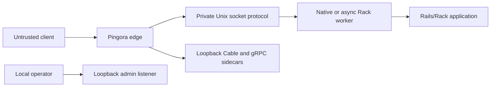

# Oxo Threat Model

This document describes implemented trust boundaries, executable checks and
known limits. Oxo is early/alpha software; public `production` mode is unavailable.
Explicit `alpha` and `smoke-beta` modes enable constrained public listeners.
Passing correctness tests does not establish production capacity, full protocol
conformance or safety for every deployment.

## Exposure and trust boundaries

Public modes require TLS, an explicit body cap, a configured server name and an
identity policy. Smoke-beta also requires loopback admin health and a global
request cap. Public TLS identity checks require a single ASCII DNS FQDN and a
matching certificate DNS SAN. `--serve-rails` supplies convenience defaults but
does not fulfill explicit public-mode requirements.

The client is untrusted. The service, app code and configured local worker/sidecar
executables are trusted deployment components. Socket permissions restrict local
access; they do not protect against a compromised same-user process or host.
Native Ruby extensions execute native code in the worker. The separate worker
process contains its exit relative to the edge; the in-process embedded handler
does not provide that boundary.

## Request and worker boundaries

| Property | Mechanism | Executable coverage |
|---|---|---|
| Private worker socket | Runtime-directory ownership and permissions; socket mode 0600; unsafe paths rejected. | `worker_uds`, `service_runner`, async lifecycle checks |
| Validation before worker acquisition | Validate target, headers and framing; buffer a complete bounded Rack body before checking out or connecting a worker. | `fake_upstream`, `worker_e2e`, acquisition witness tests |
| Bounded binary framing | Magic/version, envelope and nested lengths checked before app dispatch; partial frames close. | `hop_frame` unit tests, fuzz targets, async protocol checks |
| Strict direct HTTP parsing | Origin-form HTTP/1.1, one Host, unambiguous Content-Length; reject unsupported transfer coding and malformed headers. | `worker_uds`, parser unit tests |
| Identity separation | Forwarding/client-IP and reserved x-oxo-* headers are filtered; trusted identity uses native fields or reserved hop metadata. | `worker_e2e`, header-filter unit tests, environment parity checks |
| Pool reuse at clean boundaries | Empty read buffer required at checkin; surplus bytes, errors, cancellation and drain discard connections. | frame-hop unit tests, `frame_replay`, `service_async` |
| Async replay prevention | A completed request write followed by zero-response-byte EOF is terminal, because the app may already have executed. | `frame_replay`, warm-pool invocation-count checks in `service_async` |
| Canonical response framing | Server-controlled length/connection headers; repeated cookies preserved; invalid response header bytes dropped. | `worker_uds`, `worker_e2e`, `fake_upstream` |
| Ruby exception handling | Construct a 500 when possible; do not append an error frame after response bytes may have been sent. | `worker_e2e`, async protocol and lifecycle checks |

The HTTP hop is one-shot; the binary hop pools sequential exchanges. Their
connection policies must not be conflated. Native workers retain a distinct
stale-connection retry policy; the async EOF rule does not describe every native
error outcome.

The centralized client-forwarding predicate is shared by Rust boundary checks.
The Ruby worker has corresponding filtering checked by conformance tests. Rails
RemoteIp consumes Client-IP and X-Forwarded-For, making those headers part of the
identity boundary. Review additional provider headers when integrating a new
identity consumer; a denylist does not automatically cover future header names.

## Public protocol and resource checks

The edge rejects ambiguous HTTP/1 framing, unsupported transfer coding, malformed
targets, oversized headers and unsupported protocol upgrades before Rack worker
acquisition. HTTP/2 body handling accepts END_STREAM-delimited input without a
Content-Length and applies the body cap. Reused HTTP/1 connections receive request
validation again; tested smuggling vectors reject and close rather than leaving
the connection reusable. These are checked by `fake_upstream`, `h2_hardening`
and optional `h2spec` coverage.

Configured concurrency caps apply before worker dispatch, and admission guards
release capacity on completion or cancellation. Per-identity counts use the
resolved identity. They are not distributed quotas or request-rate limits.
Long-lived responses have aggregate admission, byte accounting and bounded
downstream writes. Header, body and protocol rejection alone does not establish
general slow-client fairness or capacity under attack.

Known enforcement limits:

* Keepalive idle timeout bounds each read gap, not total header-read duration.
  A client that keeps sending below the idle threshold can extend that duration.
* `--header-read-timeout-ms` and `--max-connection-secs` are parsed and reported
  but not enforced by the Pingora path. Non-default settings produce a
  `NOT ENFORCED` notice; admin health reports the enforcement state.
* HTTP/1 keepalive request and idle bounds do not provide HTTP/2 connection idle
  or absolute-age bounds. HTTP/2 has separate stream and reset limits.
* Admission counts requests after validation. Earlier rejects are not admitted;
  tested rejects close their connections, but there is no in-process request-rate
  limiter or general accept-level connection-count cap in the Pingora path.
* Request bodies remain memory-buffered; there is no tempfile spill. Native
  response streaming and buffered async responses have different memory behavior.

Static requests pass validation and admission before crenel handles canonical
path resolution. Explicit docroots are validated at boot and in --check-config.
Production static routing pins first path segments at startup; newly introduced
top-level files may require a restart. It does not bypass path validation or
enable public `production` mode.

## Long-lived protocols and fixtures

Validated HTTP/1 Action Cable upgrades route only to the configured loopback
Cable sidecar. Origin, Host and subprotocol checks precede routing. Native gRPC
uses the configured loopback sidecar over TLS/H2 with status/trailer handling;
it does not pass through Rack. Native worker SSE requires streaming configuration.
These paths have dedicated Action Cable, gRPC and Rails streaming tests.

Generic WebSocket proxying, Rack hijack, gRPC-Web, distributed application-session
affinity and zero-drop long-lived drain are unsupported. Local connection-affinity
dispatch is not an application-session guarantee.

Fixtures distinguish in-process pressure simulation, file-bus Cable fanout and
real container-based Postgres/Redis checks. The external-service tier requires
explicit execution and prerequisites; compilation or a simulated pass is not a
real-service result. See [the test guide](../test/README.md) for commands and
which suites require external services. No fixture result establishes cloud
deployment compatibility or production pool sizing.

## Process lifecycle and diagnostics

The service clears child environments, forwards allowlisted configuration and
logs redacted summaries. Worker readiness verifies the expected socket and
permissions after a bounded handshake. Respawn and drain are bounded, and process
groups allow cleanup of child descendants. Forced shutdown can still interrupt
in-flight work. Raw fork-after-Ruby-preload, worker RSS recycling, inherited
listener/socket activation and zero-drop phased restart are unsupported.

Admin endpoints use a separate loopback listener and expose aggregate health and
counters. Application /live or /ready routes do not become admin endpoints.
There is no public authenticated admin API. Generated request IDs identify edge
events without trusting inbound IDs; test failure artifacts must still be handled
as local diagnostic output because application logs may contain sensitive data.

## Certificate lifecycle

The optional acme feature serves exact HTTP-01 token paths on a separate challenge
listener, checks the configured host and never acquires Rack worker sockets.
Issuance and renewal maintain certificate state, failure backoff and retained
certificate/key pairs. Production Let's Encrypt directory use requires explicit
consent and consistent configuration; it does not enable public production app mode.

The service can schedule renewal children and restart the edge to load a new
pair. It retries startup and can roll back to the retained pair. This is bounded
restart, not in-process hot reload or a zero-drop certificate transition. Preserve
state-directory and key permissions; availability depends on renewal succeeding
before expiration and on correct external challenge routing.

## Dependencies and validation limits

Rust dependency versions and policy are recorded in Cargo.lock and deny.toml;
Ruby fixtures have their own lockfiles. Advisory exceptions are explicit policy
entries, not evidence that a dependency is free of vulnerabilities. Static tests
and local checks do not replace reviewing updated advisories and dependency code.

The runtime target is Linux. Windows default builds exercise Ruby-free stubs,
not native Windows Ruby hosting. Correctness, protocol and lifecycle tests do not
establish universal production readiness, capacity, leak freedom or comparative
performance. Optional instrumentation reports measurements for its workload;
those measurements are not deployment guarantees.
