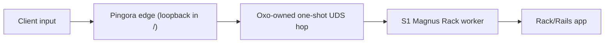

# Oxo Threat Model

This is the current security ledger. It records what Oxo actually protects
today, which tests back those claims, and what remains deferred.

## Current Exposure Rule

Oxo has explicit public-bind alpha and smoke-beta modes, but it is **not yet
safe for production public internet exposure**. The shipped S1 worker is a private UDS backend. The
 exposure phrase remains current: production mode remains unavailable;
smoke-beta remains the maximum public exposure claim. The
 Pingora edge proves a fake-upstream worker-hop contract, proves Pingora ->
real S1 -> Rack/Rails request/response, proves a spawn-supervised worker
pool, preflights public-H1 rejects, proves TLS/H1+H2, and allows
non-loopback bind only with explicit alpha mode, TLS, direct-public identity,
body-cap, and server-name gates. adds `smoke-beta`, requiring private
loopback admin health and proving Rails request/response over public TLS/H1 and
TLS/H2. adds public Host/authority enforcement and H2 abuse rejects before
worker acquisition. adds a bounded Unix lifecycle/drain contract for the
service runner: edge-first process-group `TERM`, worker `TERM`, deadline-based
process-group `KILL`, and no-orphan evidence. adds an opt-in Rack streaming
response substrate. broadens protocol-confusion rejects and proves app
`/live`/`/ready` paths are not private admin dispatch. adds standalone
Action Cable as a separate supervised loopback runtime with origin/cookie
WebSocket fixture proof, but no external Redis deployment, edge `/cable` route, or
Rack hijack. adds loopback-only SSE/Rails live streaming with incremental
`ActionController::Live` fixture proof, and adds public smoke-beta SSE/Rails
live with long-lived accounting, memory-envelope cancellation, downstream
disconnect cancellation, and Rails TLS first-event flush evidence, but no
zero-drop long-lived drain. adds private admin operator counters and redacted
service-runner env summaries; these are private diagnostics, not public admin
or production observability. adds a benchmark/stress report, burst smoke, and
production-candidate RC audit for the constrained tested matrix only. adds no runtime boundary; it locked the - operator/protocol
plan and the NO-GO gates for beta, long-lived protocols, gRPC, and RC claims.
 adds no runtime boundary; it records the future public-production arc and
keeps `production` unavailable until the final audit milestone. adds typed
CLI public config and service-runner edge argv handoff. adds controlled
ACME HTTP-01 first issuance behind the `acme` feature, with an ACME-only
challenge listener, Host/FQDN matching, and no worker acquisition. adds
certificate lifecycle state: renewal decisions, backoff/rate-limit diagnostics,
old cert/key retention, private expiry/reload telemetry, and bounded-restart
reload metadata. adds one-FQDN direct-public Rails HTTP correctness by
requiring a single ASCII DNS FQDN, requiring the public TLS certificate DNS SAN
to match that FQDN, and proving verified TLS/SNI plus strict-host Rails
production-environment HTTPS metadata, secure cookies/session, CSRF, redirects, and URL
generation. adds a public HTTP/H2 hardening floor with raw TLS/H2 rapid-reset,
continuation-flood, and flow-control abuse rejects before worker acquisition,
CL0 residue no-second-worker proof, and explicit owned-path body/worker/downstream
wait timeouts. adds trusted-proxy identity for explicit CIDRs and canonical
`X-Forwarded-For`, while preserving direct-public spoof stripping. adds
per-identity concurrent admission fairness and aggregate private observability.
 adds local Rails DB/Redis pressure evidence, adds aggregate long-lived
response accounting, and adds public Action Cable `/cable` routing to the
standalone loopback Cable sidecar plus local two-runtime redis-fixture fanout.
 routes public native unary gRPC to the standalone gruf sidecar, and
routes public native streaming gRPC to the same sidecar under aggregate
long-lived admission/accounting. rejects systemd socket-activation env
markers, keeps inherited listener descriptors outside the contract, and records
bounded restart/direct bind/high-port mapping as the accepted deploy shape.
accepts spawn-supervised `oxo-worker` processes as the cluster model and
keeps raw fork-after-Ruby-preload, CRuby-prefork, CoW preload, and Puma cluster
parity outside the contract. rejects native Windows Ruby/Magnus runtime
support; Windows remains Ruby-free default workspace/stub support only.
audits the public-production path and leaves production mode unavailable; the
edge still accepts only `alpha` and `smoke-beta`, and `production` is tested as
rejected.
 reconciles live docs and Oxo-owned comments only. adds bounded
migration docs and a NO-GO production re-audit. This remains smoke-beta evidence,
not production mode. The only intended remaining gate before a later narrow
production-mode review is Linux metal soak/capacity evidence for the exact
matrix; all other unproven areas remain explicit non-claims unless a later
reviewed milestone changes them with tests.

## Current Trust Boundaries

Client input is untrusted. The edge may synthesize trusted `x-oxo-*`
metadata only from edge state. The worker consumes reserved `x-oxo-*` fields
as internal metadata and never exposes them as Rack `HTTP_*` headers.

## S1 Worker Guarantees

| Guarantee | Current mechanism | Test evidence |
|---|---|---|
| Private worker hop | S1 binds a Unix-domain socket in a private runtime directory and sets socket mode `0600`. | `worker_refuses_unsafe_socket_paths` |
| Strict worker parser | HTTP/1.1, origin-form, single `Host`, `Content-Length` only, no TE, duplicate headers, obs-fold, bare LF, BWS before colon, `Expect`, `Upgrade`, or trailers. | `strict_parser_rejects_conformance_cases_before_app_call` |
| Bounded request body | Worker rejects `Content-Length > max_body` before Rack call; accepted bodies are buffered in memory and exposed as rewindable `StringIO`. | `strict_parser_rejects_conformance_cases_before_app_call`, resource-policy docs |
| Trusted metadata separation | Reserved `x-oxo-*` fields feed Rack identity fields and are not exposed as `HTTP_*`. | `rack_lint_env_and_internal_metadata_are_clean`, `rack_lint_env_is_clean_through_pingora_and_real_s1_worker` |
| Spoofed identity stripping | The whole client forwarding / real-IP / CDN-client-IP class (`Forwarded`, `X-Forwarded-*`, `X-Real-IP`, `Client-IP`, `True-Client-IP`, `CF-Connecting-IP`, `X-Client-IP`, `Fastly-Client-IP`, `Fly-Client-IP`, `X-Cluster-Client-IP`, `X-Original-Forwarded-For`, `X-Appengine-User-IP`, `X-Azure-ClientIP/SocketIP`, `X-ProxyUser-IP`, …) plus reserved client `x-oxo-*` headers are stripped before Rack env construction — Rails `ActionDispatch::RemoteIp` default-trusts `HTTP_CLIENT_IP`, so any of these reaching the env would spoof `request.remote_ip`. The forwarding/client-IP set is a **single source of truth** (`oxo_core::is_client_forwarding_header`, ) shared by the HTTP parser, frame decoder, edge strip, and identity resolver — a comprehensive denylist (an allowlist is infeasible: arbitrary app headers must pass). **Periodic-review obligation:** new provider client-IP headers must be added to that predicate. | `parser_strips_spoofable_identity_headers`, `frame_converter_reapplies_reserved_name_drop_table`, `strips_spoofable_and_connection_token_headers`, `rack_lint_env_and_internal_metadata_are_clean`, `raw_rack_request_response_runs_through_pingora_and_real_s1_worker` |
| Response framing canonicalization | Worker strips app `Content-Length`, `Transfer-Encoding`, and `Connection`; computes one `Content-Length`; forces `Connection: close`; drops CR/LF/CTL-bearing response headers. | `response_writer_canonicalizes_app_framing_and_preserves_cookies`, `raw_rack_request_response_runs_through_pingora_and_real_s1_worker` |
| Ruby exception containment | Ruby exceptions become Rack `500` responses inside the worker process. | `raw_rack_request_response_runs_through_pingora_and_real_s1_worker`, `rails_seed_request_response_runs_through_pingora_and_real_s1_worker` |

## Pingora Fake-Upstream Guarantees

 proves the edge-side worker-hop contract against a recording fake UDS worker:

| Guarantee | Current mechanism | Test evidence |
|---|---|---|
| Fixed upstream | Edge uses only the configured absolute UDS path; request input cannot select an upstream. | `forwards_sanitized_request_to_recording_uds_worker`, config validation tests |
| No pre-validation UDS acquisition | Target/header/body validation and complete declared-body buffering happen before `UnixStream::connect`. | `over_cap_body_returns_413_without_touching_upstream`, `short_body_does_not_create_partial_worker_request`, and adversarial fake-upstream rejects |
| Body cap | `Content-Length > OXO_EDGE_MAX_BODY` returns `413` before opening the worker UDS. | `over_cap_body_returns_413_without_touching_upstream` |
| Short body containment | Incomplete declared bodies reject before any partial worker request exists. | `short_body_does_not_create_partial_worker_request` |
| Smuggling-class rejects | Duplicate `Content-Length`, duplicate Host, `Transfer-Encoding`, trailers, obs-fold, whitespace before colon, invalid header bytes, absolute-form targets, ambiguous connection tokens, CONNECT, h2c, Upgrade, WebSocket marker, gRPC/grpc-web, SSE marker by default, H2-preface-on-H1, pseudo-header confusion, and oversized request headers reject before UDS acquisition. Ordinary `Content-Length: 0` is accepted as empty. | `fake_upstream` adversarial corpus |
| Smuggling-class rejects hold under downstream keepalive reuse  | With opt-in `--keepalive` connection reuse, the front-door validation re-runs for every request on a reused connection (CTX is per-request), and every desync/smuggling reject force-terminates its connection (pingora `respond_error` → `set_keepalive(None)`), leaving no reused-connection state a follow-up request could exploit. Pipelined overread and body-bearing early rejects close structurally (`reuse` / `close_on_response_before_downstream_finish`). Reuse introduces no new desync class. See `docs/KEEPALIVE_DESYNC_AUDIT_V68G.md`. | `keepalive_reused_connection_desync_corpus`, `keepalive_pipelined_cl0_residue_same_read_closes`, `keepalive_second_request_independently_validated`, `keepalive_body_bearing_early_reject_closes` |
| Trusted-hop identity | Inbound spoofable forwarding/reserved headers are stripped; edge-owned `x-oxo-*` metadata is synthesized. | `forwards_sanitized_request_to_recording_uds_worker` |
| One-shot worker framing | Edge writes one canonical HTTP/1.1 request with computed `Content-Length` and `Connection: close`. | `forwards_sanitized_request_to_recording_uds_worker`, `post_body_reaches_worker_exactly_after_full_buffering`, `multipart_like_body_reaches_worker_exactly_after_full_buffering` |
| Failure mapping | Missing worker maps to `503`; malformed/reset/oversized worker response maps to `502`. | `missing_worker_socket_maps_to_503`, response failure tests |
| Response framing | Fixed worker responses canonicalize `Connection` and `Content-Length`; opt-in chunked worker responses are decoded and forwarded; repeated `Set-Cookie` is preserved. | `repeated_set_cookie_survives_worker_hop`, `upstream_framing_headers_are_canonicalized_downstream`, `chunked_worker_response_is_decoded_and_forwarded_downstream`, `malformed_chunked_worker_response_maps_to_502` |

## Attack And Failure Paths

| Path | Current behavior |
|---|---|
| Over-cap body | Edge returns `413` before UDS acquisition; worker also rejects over-cap bodies if reached directly. |
| Short body or early EOF | Edge returns client error before UDS acquisition; worker rejects short bodies on direct UDS. |
| Smuggling-class framing | Edge and worker reject unsupported TE, duplicate CL, malformed headers, and absolute-form targets. |
| Missing worker | Edge maps connect failure to `503`. |
| Broken worker response | Edge maps malformed/reset/oversized response to `502`. |
| Rack app exception | S1 converts Ruby exception to worker `500`; proves this through Pingora and then a healthy next request. |
| WebSocket/Action Cable | routes validated H1 `/cable` Action Cable upgrades to the standalone loopback Cable sidecar without acquiring the Rack worker UDS. Generic WebSocket proxying, Rack hijack, and in-app Cable remain unsupported. |
| Rack streaming | Opt-in Rack callable/enumerable response streaming exists; request bodies remain buffered. |
| SSE/Rails live streaming | supports loopback opt-in SSE/Rails live streaming; supports public smoke-beta SSE/Rails live in the tested matrix with aggregate accounting/bounds. Zero-drop long-lived drain and production slow-client guarantees remain unsupported. |
| gRPC | Rack/Pingora worker-hop gRPC remains a stable reject. adds standalone loopback gRPC runtime supervision, proves supervised Rails/gruf unary behavior, routes public smoke-beta native unary gRPC to that standalone sidecar without acquiring the Rack worker UDS, and routes public smoke-beta server-streaming, client-streaming, and bidi gRPC to the same sidecar under aggregate long-lived admission/accounting. Rack gRPC, gRPC-Web, production gRPC, zero-drop drain, and gRPC-specific external DB/Redis pressure are not claimed. |
| Operator diagnostics | private admin counters and service-runner env summaries redact secrets and use generated request ids. documents the private `/ready`/`/metrics` schema, manifest, scrape topology, and runbooks. They are loopback/private only and are not public admin, public metrics, OpenTelemetry/Prometheus exporter, or SLO evidence. |
| ACME HTTP-01 and lifecycle | challenge handling serves only exact token paths for the configured FQDN, validates token grammar, and does not acquire worker sockets. adds renewal-window decisions, retained old cert/key material, failure backoff diagnostics, private expiry/reload telemetry, and bounded-restart-required metadata without plaintext fallback. It is not production ACME endpoint use, in-process hot reload, zero-drop reload, or public app routing. |
| Public TLS/FQDN/Rails identity | public modes require a single ASCII DNS FQDN and a TLS certificate DNS SAN matching that FQDN before startup. The Rails fixture proves verified TLS/SNI, strict hosts, HTTPS Rack metadata, secure cookies/session, CSRF, redirects, and URL generation for one FQDN. |
| Public HTTP/H2 hardening floor | raw TLS/H2 rapid-reset, continuation-flood, and flow-control abuse inputs reject before worker acquisition; CL0 residue does not become a second worker request; owned-path body, worker, and downstream waits are explicitly bounded. |
| Trusted-proxy identity | trusted-proxy mode requires explicit trusted proxy CIDRs, trusts only the immediate peer, accepts only canonical `X-Forwarded-For`, rejects malformed/ambiguous chains before worker acquisition, strips forwarding headers before Rack, and proves Rails `RemoteIp` from edge metadata. |
| Per-identity fairness and private aggregate observability | public-mode admission caps concurrent in-flight requests per resolved identity, rejects same-identity saturation with `503` before worker acquisition, allows different identities to proceed under their own caps, and exposes only aggregate private `/ready` and `/metrics` counters. |
| DB/Redis pressure fixture | Rails fixture uses local bounded DB-like and Redis-like pools plus a standalone Action Cable `oxo_redis_fixture` adapter; proves local redis-fixture fanout; adds dev-host container Postgres/Redis pressure evidence through `production_external`. This is not external-cloud deployment, capacity, sticky-session, or production pool-sizing evidence. |
| Supply-chain advisories | re-runs RustSec `cargo-audit`, cargo-deny policy, and ruby-advisory-db `bundler-audit` over the resolved Rust/Ruby graphs where local tools are available. The pinned Pingora/protobuf advisory remains explicitly waived pending Pingora/prometheus bump. This is not SBOM, SLSA, vendored-source review, or future-advisory absence evidence. |
| Soak/stress evidence | adds a dev-only soak harness and WSL one-hour smoke for harness mechanics; records Linux metal soak/capacity evidence as the only intended remaining gate. WSL output is not public internet readiness, leak-freedom, latency, capacity, benchmark-superiority, or production-mode evidence. |

## Deferred Risks

* Blanket production public exposure remains outside the RC, and keeps
 public `production` mode unavailable; the accepted public path is smoke-beta
 under the documented TLS, host, body-cap, identity, private-admin, and
 topology-specific gates.
* real S1/Rails E2E is green, but only under the loopback test harness.
* proves bytes after an ordinary `Content-Length: 0` request do not become a
 second worker request through Pingora's request boundary; it is not a general
 raw H1 parser-conformance claim beyond that boundary.
* No distributed/token-bucket rate limiting, broad public slow-client policy,
 per-identity public long-lived fairness, or full H2 conformance has been accepted yet.
* config-surface honesty (three explicit non-claims, tested behaviorally):
 (a) **Request rate is un-bounded (no in-process limiter); use an upstream layer.**
 Admission caps concurrency, not rate. Enabling keepalive removes the per-request
 TLS-handshake tax so one connection serves up to `--max-requests-per-connection` VALID
 requests per handshake, raising achievable valid-request throughput. Pre-admission
 rejects (missing/invalid host, header-cap, drain) are un-metered by the admission counter
 (they return before it), but pingora's `respond_error` forces the connection closed, so a
 reject cannot be reused for a second reject — rejects are self-limiting, one per
 connection setup, and keepalive does NOT worsen the cheap-reject rate
 (`reject_pre_admission_is_un_metered_and_closes_connection`).
 (b) **The keepalive idle timeout is a per-read gap bound, not a total deadline.** Total
 within-request header-read time is unbounded (only the ~1 MiB header cap stops a
 sub-idle dribble); a single read gap over the idle window closes the connection
 (`slow_header_dribble_on_reused_connection`).
 (c) **`--header-read-timeout-ms` and `--max-connection-secs` are parsed-but-not-enforced**
 — no pingora 0.8.1 seam. Setting either to a non-default value emits a `NOT ENFORCED:`
 line at boot and under `--check-config`, and `/ready` reports the corresponding
 `slow_client_*_enforced:false` (operator_schema ``).
* `--serve-rails` preset: an opt-in composite of ALREADY-REVIEWED settings only
 ( keepalive, / SSE under the long-lived caps, static mounts). It
 never satisfies or weakens a public-mode explicit gate (body cap, FQDN, TLS, identity,
 admin bind, in-flight caps — tested by `serve_rails_does_not_satisfy_public_mode_gates`),
 a typo'd app root refuses boot unconditionally, and explicit flags/env always beat the
 preset. Evidence caveat (narrowed by ): keepalive is bounded (idle timeout +
 request cap) and records a WSL-INDICATIVE keepalive bench + a sustained-load
 EDGE-PROCESS RSS/fd soak with hold-open idle-expiry phases
 and a comparative/production claim still requires the deferred Linux-metal run — the
 docs say so at point of use.
* keepalive arc close — the full desync re-audit under connection reuse
 (`docs/KEEPALIVE_DESYNC_AUDIT_V68G.md`, verdict: reuse introduces no new desync class)
 and the consolidated residual-non-claims ledger. The keepalive arc does NOT claim:
 (a) an absolute connection-age cap (`--max-connection-secs` parsed-but-not-enforced, );
 (b) an in-process connection-COUNT / accept-level cap; (c) a request-RATE limiter ( —
 rejects are self-limiting but there is no limiter); (d) a total within-request header-read
 deadline (per-read gap only, ); (e) an H2 connection idle/absolute-age bound
 (framework-blocked, — `--keepalive` and the request cap are H1-only); (f) any
 metal/production performance claim (WSL-indicative bench+soak only, Rails worker memory
 not soaked, ). NARROWED: the keepalive idle timeout IS operator-enforced under
 `--keepalive` (`set_keepalive(Some(idle_secs))`, never `Some(0)`/Infinite; `/ready`
 `slow_client_keepalive_idle_timeout_enforced` mirrors the flag), inert under the one-shot
 default. This supersedes the pre- "keepalive-idle timeout is not operator-enforced"
 non-claim.
* No generic public WebSocket proxying outside standalone Cable, external-cloud Redis Action Cable deployment or capacity guarantee, in-app Action Cable/Rack hijack, or tempfile spill support.
* No Rack gRPC, gRPC-Web, production gRPC, gRPC-specific external DB/Redis pressure, or external-cloud DB/Redis deployment support outside the dev-host container evidence tier.
* No production ACME endpoint use, background renewal daemon, in-process cert hot reload, zero-drop reload, dual app listener, public admin endpoint, public metrics endpoint, OpenTelemetry/Prometheus exporter, distributed tracing, production SLO, Linux metal capacity, or production soak claim.
* adds bounded process-group drain/KILL cleanup, but there is still no
 prefork cluster, sticky sessions, RSS recycle, zero-drop request drain,
 protocol-specific long-lived cancellation, hot reload, or public health
 endpoint.
* No speed or production-superiority claim; the burst smoke is a behavioral
 stress gate, not a comparative benchmark against nginx+Puma or alternatives.

protocol, lifecycle, cluster, Windows, benchmark, and supply-chain gates.
